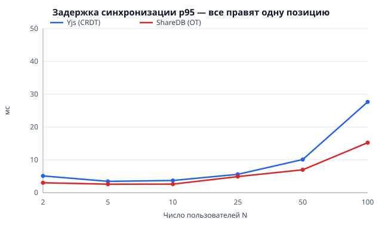

# Результаты стенда: CRDT (Yjs) против OT (ShareDB)

Запуск: 2026-10-02T10:40:23.395Z. Node v22.18.0, Windows_NT 10.0.22631 x64, AMD Ryzen 7 5700U with Radeon Graphics (16 потоков), 14 ГБ ОЗУ. Повторов на точку: 3; длительность набора: 10 с; скорость набора: 1 правок/с на пользователя.

Сервер каждой системы запускается отдельным процессом (чтобы честно измерить его CPU и память), а боты-клиенты работают в отдельных процессах (до 8, по 12 клиентов на процесс), чтобы генератор нагрузки не стал узким местом. Задержка измеряется от вызова вставки у автора до появления правки у другого клиента (общие часы машины). Серверы сравниваются без базы данных: Hocuspocus в памяти и ShareDB с in-memory хранилищем, то есть сравнивается сам алгоритм синхронизации, а не слой хранения.

## 1. Одновременный набор: задержка, корректность, нагрузка

### Правки в разных местах файла

| N | Система | ср. мс | p50 | p95 | p95, разброс повторов | p99 | CPU сервера, % | RSS, МБ | байт/правку | Сошлись, ничего не потеряно | Стенд не перегружен |
| --- | --- | --- | --- | --- | --- | --- | --- | --- | --- | --- | --- |
| 2 | Yjs (CRDT) | 2.5 | 2.0 | 7.0 | 4.0–9.3 | 8.7 | 0 | 87 | 141 | да | да |
| 2 | ShareDB (OT) | 1.8 | 1.6 | 3.4 | 2.4–4.2 | 4.0 | 0 | 74 | 311 | да | да |
| 5 | Yjs (CRDT) | 2.3 | 2.1 | 3.4 | 3.1–3.5 | 7.7 | 0 | 86 | 275 | да | да |
| 5 | ShareDB (OT) | 1.7 | 1.6 | 2.4 | 2.3–2.6 | 4.3 | 0 | 75 | 705 | да | да |
| 10 | Yjs (CRDT) | 2.5 | 2.4 | 3.9 | 3.8–3.9 | 5.7 | 0 | 87 | 490 | да | да |
| 10 | ShareDB (OT) | 1.8 | 1.8 | 2.6 | 2.6–2.7 | 4.2 | 1 | 75 | 1363 | да | да |
| 25 | Yjs (CRDT) | 3.0 | 2.8 | 6.0 | 4.7–7.3 | 8.0 | 1 | 93 | 1147 | да | да |
| 25 | ShareDB (OT) | 2.7 | 2.0 | 6.7 | 4.5–8.3 | 8.2 | 1 | 78 | 3355 | да | да |
| 50 | Yjs (CRDT) | 4.5 | 4.0 | 10.3 | 9.1–11.1 | 15.4 | 1 | 96 | 2323 | да | да |
| 50 | ShareDB (OT) | 3.7 | 2.8 | 9.4 | 7.0–12.3 | 11.9 | 1 | 79 | 6686 | да | да |
| 100 | Yjs (CRDT) | 11.8 | 9.9 | 28.7 | 25.7–33.9 | 41.5 | 12 | 95 | 4743 | да | да |
| 100 | ShareDB (OT) | 5.8 | 5.0 | 13.4 | 12.6–14.1 | 18.9 | 8 | 86 | 13360 | да | да |

### Все вставляют в одну и ту же позицию (максимум конфликтов)

| N | Система | ср. мс | p50 | p95 | p95, разброс повторов | p99 | CPU сервера, % | RSS, МБ | байт/правку | Сошлись, ничего не потеряно | Стенд не перегружен |
| --- | --- | --- | --- | --- | --- | --- | --- | --- | --- | --- | --- |
| 2 | Yjs (CRDT) | 2.4 | 2.0 | 5.1 | 3.3–8.5 | 8.4 | 0 | 87 | 127 | да | да |
| 2 | ShareDB (OT) | 1.8 | 1.6 | 3.0 | 2.4–4.2 | 4.5 | 0 | 73 | 310 | да | да |
| 5 | Yjs (CRDT) | 2.2 | 2.0 | 3.5 | 3.0–3.9 | 8.0 | 0 | 87 | 241 | да | да |
| 5 | ShareDB (OT) | 1.7 | 1.5 | 2.6 | 2.5–2.8 | 3.8 | 1 | 74 | 704 | да | да |
| 10 | Yjs (CRDT) | 2.5 | 2.4 | 3.7 | 3.4–4.0 | 6.6 | 1 | 89 | 432 | да | да |
| 10 | ShareDB (OT) | 1.8 | 1.7 | 2.6 | 2.6–2.7 | 3.6 | 0 | 75 | 1347 | да | да |
| 25 | Yjs (CRDT) | 3.0 | 2.9 | 5.6 | 4.5–6.4 | 7.5 | 1 | 93 | 1039 | да | да |
| 25 | ShareDB (OT) | 2.4 | 2.2 | 4.9 | 4.1–6.1 | 6.3 | 1 | 77 | 3307 | да | да |
| 50 | Yjs (CRDT) | 4.4 | 3.8 | 10.1 | 8.7–11.7 | 14.1 | 1 | 95 | 2019 | да | да |
| 50 | ShareDB (OT) | 3.2 | 2.9 | 7.0 | 6.9–7.1 | 9.5 | 1 | 78 | 6565 | да | да |
| 100 | Yjs (CRDT) | 11.5 | 9.6 | 27.7 | 25.0–29.5 | 39.8 | 12 | 97 | 3996 | да | да |
| 100 | ShareDB (OT) | 6.2 | 5.1 | 15.2 | 13.5–16.9 | 23.4 | 8 | 87 | 13110 | да | да |

Контроль измерения: колонка «Стенд не перегружен» — задержка цикла событий (p99) в процессах с ботами меньше 100 мс. Если она превышена, измеренная задержка отражает перегрузку генератора нагрузки, а не сервера, и такую точку нельзя трактовать как свойство алгоритма. Фоновое значение на этой машине около 20–25 мс (гранулярность таймеров Windows).

## 2. Работа офлайн

Один клиент отключается, делает K правок локально, остальные в это время делают ещё K правок; затем клиент возвращается. Время отсчитывается от момента переподключения до совпадения текста у всех.

| K | Система | Слияние, мс | Разброс повторов, мс | Трафик при слиянии, КБ | Сошлись, ничего не потеряно |
| --- | --- | --- | --- | --- | --- |
| 50 | Yjs (CRDT) | 39 | 36–41 | 16.0 | да |
| 50 | ShareDB (OT) | 16 | 15–16 | 5.6 | да |
| 200 | Yjs (CRDT) | 84 | 80–90 | 67.3 | да |
| 200 | ShareDB (OT) | 16 | 16–17 | 16.8 | да |
| 1000 | Yjs (CRDT) | 260 | 239–301 | 346.1 | да |
| 1000 | ShareDB (OT) | 15 | 14–17 | 75.6 | да |

## 3. Размер документа

Пять клиентов делают заданное число правок (вставка одного символа или удаление 1–5 символов в случайном месте). «Чтобы открыть» — сколько байт должен получить клиент, подключающийся к документу (у Yjs это всё состояние, у ShareDB — снимок). «Хранится всего» — у ShareDB добавляется журнал операций, из которого можно восстановить любую версию; у Yjs истории версий нет, зато есть метки удалённого.

### Доля удалений 5%

| Правок | Система | Чтобы открыть, байт | Хранится всего, байт | Всего на правку, байт | Чистый текст, байт |
| --- | --- | --- | --- | --- | --- |
| 1000 | Yjs (CRDT) | 14286 | 14286 | 14.3 | 803 |
| 1000 | ShareDB (OT) | 1015 | 32713 | 32.7 | 807 |
| 5000 | Yjs (CRDT) | 76228 | 76228 | 15.2 | 4089 |
| 5000 | ShareDB (OT) | 4223 | 166445 | 33.3 | 4014 |
| 20000 | Yjs (CRDT) | 314089 | 314089 | 15.7 | 16236 |
| 20000 | ShareDB (OT) | 16331 | 678273 | 33.9 | 16122 |

### Доля удалений 30%

| Правок | Система | Чтобы открыть, байт | Хранится всего, байт | Всего на правку, байт | Чистый текст, байт |
| --- | --- | --- | --- | --- | --- |
| 1000 | Yjs (CRDT) | 9766 | 9766 | 9.8 | 171 |
| 1000 | ShareDB (OT) | 372 | 31596 | 31.6 | 164 |
| 5000 | Yjs (CRDT) | 54824 | 54824 | 11.0 | 433 |
| 5000 | ShareDB (OT) | 944 | 152581 | 30.5 | 735 |
| 20000 | Yjs (CRDT) | 220399 | 220399 | 11.0 | 111 |
| 20000 | ShareDB (OT) | 389 | 657776 | 32.9 | 180 |

## 4. Доска дизайна: перемещение фигур

| Режим | N | Система | p50, мс | p95, мс | Состояния совпали |
| --- | --- | --- | --- | --- | --- |
| каждый двигает свою | 2 | Yjs (CRDT) | 1.5 | 2.2 | да |
| каждый двигает свою | 2 | ShareDB (OT) | 1.4 | 2.1 | да |
| каждый двигает свою | 10 | Yjs (CRDT) | 1.8 | 2.9 | да |
| каждый двигает свою | 10 | ShareDB (OT) | 1.8 | 3.2 | да |
| каждый двигает свою | 50 | Yjs (CRDT) | 6.6 | 18.0 | да |
| каждый двигает свою | 50 | ShareDB (OT) | 6.3 | 17.5 | да |
| все двигают одну | 2 | Yjs (CRDT) | 1.5 | 2.3 | да |
| все двигают одну | 2 | ShareDB (OT) | 1.5 | 2.3 | да |
| все двигают одну | 10 | Yjs (CRDT) | 1.8 | 3.2 | да |
| все двигают одну | 10 | ShareDB (OT) | 1.8 | 3.1 | да |
| все двигают одну | 50 | Yjs (CRDT) | 6.8 | 18.1 | да |
| все двигают одну | 50 | ShareDB (OT) | 6.1 | 16.9 | да |

