# 2. Проектирование

## 2.1. Требования

### Функциональные

1. Одновременное редактирование одного файла несколькими пользователями с
   подсветкой синтаксиса и видимыми курсорами участников.
2. Проекты, дерево файлов, приглашение участников — по ссылке (в том числе
   гостем без регистрации) и по email.
3. Три типа файлов: код (редактор Monaco), документ Markdown с предпросмотром и
   доска дизайна (фигуры, текст, стрелки, курсоры участников, экспорт в PNG и
   SVG). Совместная работа и офлайн-режим — для всех трёх типов.
4. Чат проекта и индикатор присутствия участников.
5. Роли в проекте: владелец (`owner`), редактор (`editor`), наблюдатель
   (`viewer`); права проверяются на сервере.
6. Работа без соединения: правки накапливаются локально и автоматически
   сливаются при подключении.
7. Запуск JavaScript и Python на сервере с общим для участников выводом и
   подсветкой строки ошибки — как вспомогательная функция.
8. Вспомогательные функции, добавленные в ходе реализации: терминал в
   изолированном контейнере (п. 3.6), импорт публичного репозитория GitHub и
   отправка изменений в него коммитом, переключение веток репозитория (п. 3.8).

### Нефункциональные

- адаптивный интерфейс от телефона до десктопа;
- изоляция запускаемого кода (сеть, файловая система, привилегии, ресурсы);
- документированный REST API (OpenAPI/Swagger) и описанный WebSocket-протокол;
- развёртывание в облаке (AWS), воспроизводимая сборка и CI.

### Что сознательно не входит в объём работы

Пошаговый отладчик, полноценный Git-клиент (слияние, получение чужих изменений
из репозитория, удаление и переименование файлов в нём), голосовые и видеозвонки,
сложные инструменты дизайна (перо, компоненты, авто-раскладка,
прототипирование). Голос и видео исключены потому, что это отдельная большая
подсистема (WebRTC, сигнальный сервер, STUN/TURN), не связанная с
исследовательским вопросом работы и не укладывающаяся в сроки её выполнения.

### Соответствие критериям сложности

| Критерий | Чем закрыт |
|---|---|
| Back-end / Front-end | Node.js: REST API, сервер синхронизации, обработчик очереди запусков; React SPA |
| Adaptive UI | Вёрстка на Tailwind от телефона до десктопа, предпросмотр Markdown, доска |
| Database | PostgreSQL (RDS), Prisma-миграции |
| Cloud | AWS: EC2, RDS, S3, CloudFront |
| API documentation | OpenAPI/Swagger для REST, описание WebSocket-протоколов в `docs/` |

## 2.2. Архитектура

Система состоит из клиентского приложения, трёх серверных сервисов на Node.js
и двух хранилищ:

| Компонент | Назначение |
|---|---|
| `web` | React SPA: редакторы (Monaco, доска на Konva), чат, управление проектами; PWA |
| `api` | REST (Fastify), авторизация, проекты, файлы, чат, приглашения; WebSocket `/ws` для событий проекта |
| `collab` | WebSocket-сервер синхронизации документов (Hocuspocus/Yjs), проверка прав, хранение снимков |
| `runner` | Обработчик очереди (BullMQ): исполнение кода в изолированных Docker-контейнерах; сервер терминалов (WebSocket) |
| PostgreSQL | Пользователи, проекты, участники, файлы (снимки Yjs), сообщения |
| Redis | Очередь задач запуска и канал событий вывода |

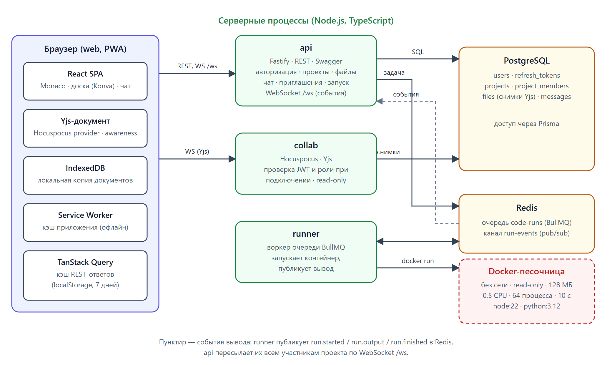

*Рис. Компоненты системы и связи между ними.*

Потоки данных:

- **Метаданные** (проекты, список файлов, роли) идут через REST и кэшируются на
  клиенте (TanStack Query с сохранением в localStorage).
- **Содержимое файлов** идёт по WebSocket в `collab`: один документ Yjs на файл.
  Клиент хранит локальную копию в IndexedDB, поэтому ранее открывавшиеся файлы
  доступны без сети.
- **Чат** — не CRDT: сообщения пишутся в PostgreSQL через REST и рассылаются
  событием по WebSocket `/ws`. Историю нужно листать страницами, а в Yjs она
  росла бы без предела.
- **Запуск кода**: `api` ставит задачу в очередь, `runner` исполняет её в
  контейнере и публикует вывод в Redis, `api` пересылает события участникам
  проекта по `/ws`.

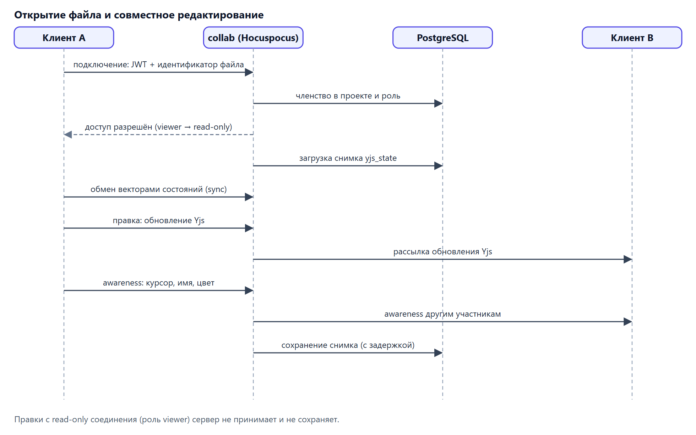

*Рис. Подключение к документу: проверка прав, загрузка снимка, обмен правками и курсорами.*

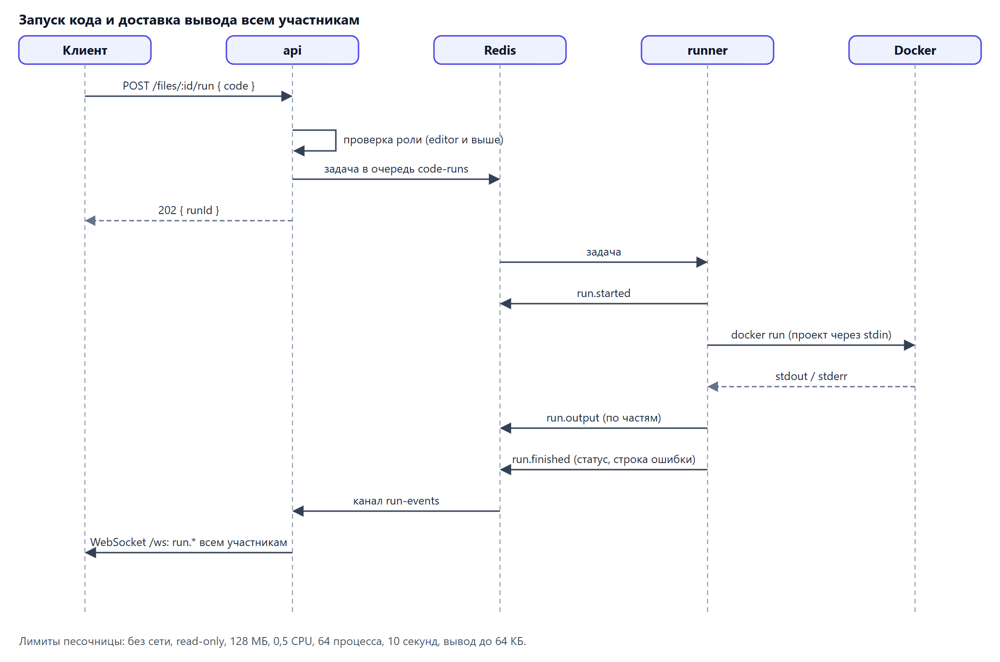

*Рис. Запуск кода: очередь, песочница и доставка вывода всем участникам проекта.*

Принятые архитектурные решения оформлены как ADR (каталог `docs/adr`):

- **ADR-001** — один Yjs-документ на файл; дерево файлов хранится в PostgreSQL.
  Следствие: офлайн доступны файлы, уже открывавшиеся на этом устройстве, а
  переименование и удаление файлов офлайн не синхронизируются.
- **ADR-002** — синхронизация через Hocuspocus отдельным сервисом (готовые хуки
  авторизации и хранения вместо собственного протокола, разработка которого
  заняла бы несколько недель).
- **ADR-003** — запуск кода в Docker через очередь; значения ограничений
  подобраны на этапе реализации (см. п. 3.6).
- **ADR-004** — один экземпляр EC2 с Docker Compose, база в RDS, клиентское
  приложение в S3 за CloudFront; путь расширения — ECS.

## 2.3. Модель данных

Шесть таблиц PostgreSQL. Содержимое файла хранится не текстом, а бинарным
снимком Yjs.

| Таблица | Ключевые поля | Связи |
|---|---|---|
| `users` | id, email, name, password_hash, **is_guest**, created_at | — |
| `refresh_tokens` | id, user_id, token_hash, expires_at, created_at | → users |
| `projects` | id, name, owner_id, **invite_code**, **invite_role**, **github_owner**, **github_repo**, **github_branch**, created_at | → users |
| `project_members` | project_id, user_id, role (owner / editor / viewer) | → projects, users |
| `files` | id, project_id, **branch**, path, type (code / doc / board), language, yjs_state (bytea), **source_sha**, updated_at, **deleted_at**, **trashed_path** | → projects |
| `messages` | id, project_id, author_id, body, created_at | → projects, users |

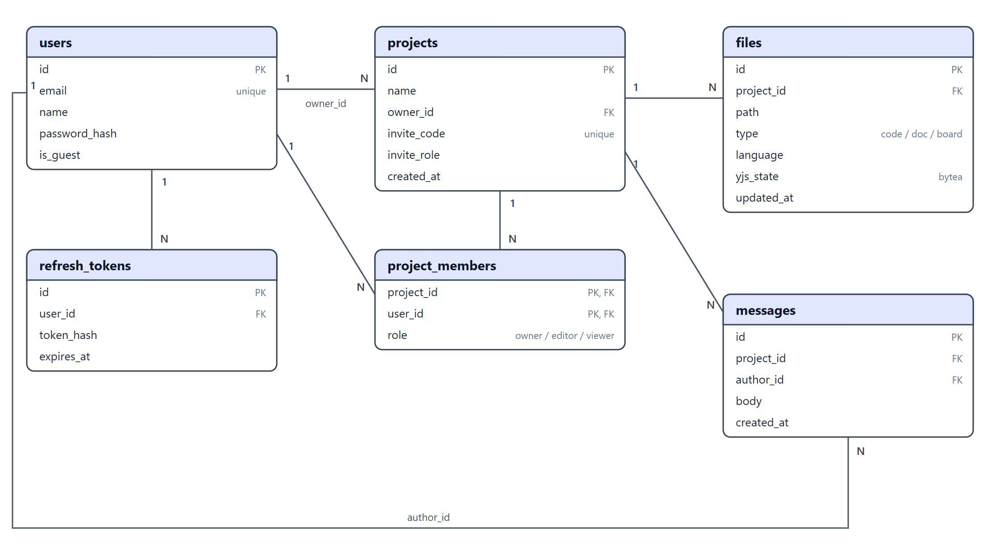

*Рис. Таблицы PostgreSQL и связи между ними (показаны не все поля: у `users` нет
`created_at`, у `refresh_tokens` — `created_at`, у `projects` — полей связи с GitHub,
у `files` — полей `branch`, `source_sha`, `deleted_at`, `trashed_path`).*

Поля, выделенные в таблице полужирным, добавлены в ходе реализации. Поля
`is_guest`, `invite_code` и `invite_role` обслуживают приглашения:
ссылка-приглашение работает как «invite-ссылка в сервер Discord» — любой, у кого
она есть, попадает в проект с заданной ролью, а гостевой вход создаёт
одноразовую учётную запись без настоящего email и пароля (служебный адрес вида
`guest-…@guest.local` и случайный пароль, который никому не сообщается). Поля
`github_*`, `branch` и `source_sha` нужны для связи с GitHub и веток (п. 3.8),
`deleted_at` и `trashed_path` — для корзины (п. 3.9); уникальность пути файла
проверяется в тройке «проект — ветка — путь». Результаты запусков кода не
хранятся: они живут в Redis до завершения задачи и рассылаются подписчикам.

### Авторизация и права

Вход выдаёт пару токенов: короткоживущий access-токен (JWT) и refresh-токен —
непрозрачную случайную строку, от которой в БД хранится только хеш; при
обновлении refresh-токен ротируется. Пароли хешируются argon2id. Права
проверяются на сервере при каждом обращении: пользователь, не состоящий в
проекте, получает ответ «не найдено» (а не «запрещено»), чтобы не раскрывать
существование проекта. В `collab` те же проверки выполняются при подключении к
документу, а для роли `viewer` соединение помечается как read-only — сервер не
принимает и не сохраняет правки с него.

## 2.4. Офлайн-режим

Офлайн опирается на две вещи: service worker кэширует само приложение (вместе с
редактором Monaco), а `y-indexeddb` хранит локальную копию каждого открытого
файла. При открытии файла документ сначала загружается из IndexedDB, затем
синхронизируется с сервером. Без сети правки пишутся только локально, индикатор
показывает «офлайн». При подключении клиент и сервер обмениваются векторами
состояний и пересылают только недостающее; CRDT сливает правки без конфликтов.

Офлайн **не** работают: чат, запуск кода, создание и переименование файлов,
файлы, ни разу не открывавшиеся на этом устройстве.

## 2.5. Интерфейс

**Принципы.** Интерфейс построен по привычной модели Discord: проект — это
«сервер», файлы — «каналы». Слева узкая колонка проектов (быстрое переключение),
рядом список файлов, сгруппированных по типам (код, документы, доски); в центре
рабочая область; справа вкладки «Чат» и «Участники». Шапка рабочей области
показывает имя файла, состояние синхронизации, аватары тех, кто сейчас в
проекте, и кнопку приглашения. Запуск кода — небольшая кнопка в шапке
редактора и сворачиваемая панель «Вывод», общая для всех участников. Роль
`viewer` видит редактор в режиме «только чтение» с пометкой в шапке.

**Визуальный язык.** Тёмная тема по умолчанию и светлая по выбору (выбор
запоминается; до первой отрисовки тема применяется скриптом в `index.html`, чтобы
при загрузке страница не мигала другой темой). Цвета заданы токенами (CSS-переменные), на которых строятся и
Tailwind-классы, и темы редактора Monaco; шрифты (Inter и JetBrains Mono)
поставляются вместе с приложением и работают офлайн. Цвет участника един во всём
интерфейсе: аватар, курсор в редакторе и на доске выбираются по идентификатору
пользователя одной функцией.

**Сценарии.** Вход: слева витрина продукта, справа форма; «Продолжить как
гость» — вторая по значимости кнопка. Главная: карточки проектов и поле
«вставьте ссылку-приглашение». Импорт: репозиторий GitHub вставляется ссылкой — в пустой проект или при
создании нового (п. 3.8). Новый файл — диалог с выбором типа (код, документ,
доска) и проверкой имени. Приглашение — диалог со ссылкой, выбором роли по
ссылке и приглашением по email. Пустой проект — подсказка с тремя быстрыми
действиями.

**Приглашённый пользователь.** Ссылка-приглашение открывает не форму входа, а страницу
«Артём приглашает вас в проект „…“» с ролью, которую он получит; гость вводит имя и
заходит одной кнопкой, а для владельца аккаунта рядом ссылки «Войти» и «Создать». Имя
можно изменить позже в меню профиля. Сообщения об ошибках сервера написаны по-русски, а
несуществующий или недоступный проект показывает отдельную страницу с объяснением вместо
бесконечной загрузки.

**Работа с файлами.** Файлы показаны деревом папок; Ctrl+P (или кнопка «Найти файл»)
открывает быстрый переход по части имени, файл можно переименовать или переместить в
папку. Удаление переносит файл в корзину проекта, откуда его восстанавливает любой
редактор, а навсегда удаляет только владелец. Открытые файлы остаются вкладками.
Перед отправкой в GitHub показывается список изменений. Проект с файлами
открывается сразу на последнем открытом файле (или README), в заголовке вкладки
браузера — имя файла. Владелец меняет роли участников и исключает их из проекта.

**Адаптивность.** На экранах шириной менее 1024 px колонки проектов и файлов
уходят в выдвижное меню, менее 1280 px — чат и участники открываются поверх
рабочей области; документ Markdown на узком экране показывает редактор и предпросмотр
друг под другом. Анимации отключаются при `prefers-reduced-motion`.

**Доступность.** Элементы управления имеют текстовые подписи (`aria-label`),
диалоги закрываются по Escape и возвращают фокус, видимая рамка фокуса задана
для всех интерактивных элементов. Контраст не проверялся специальными
инструментами.

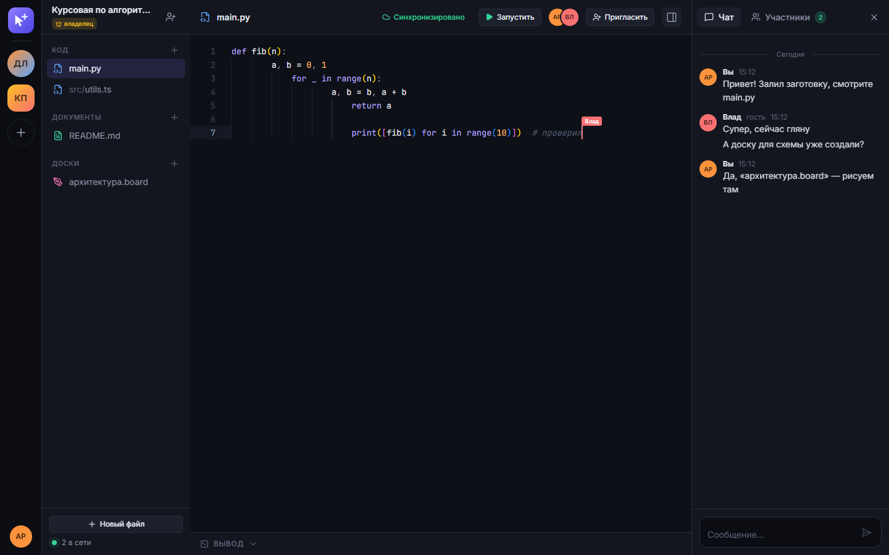
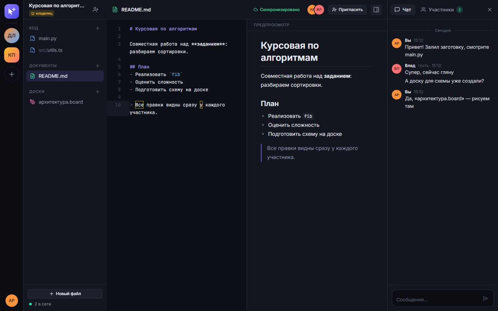
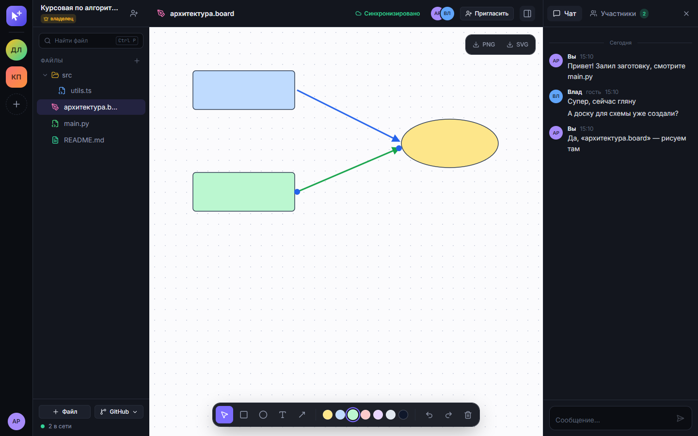
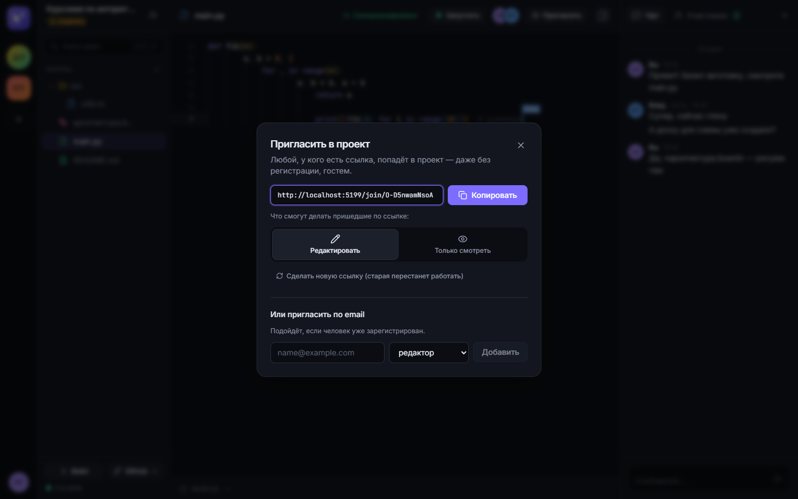
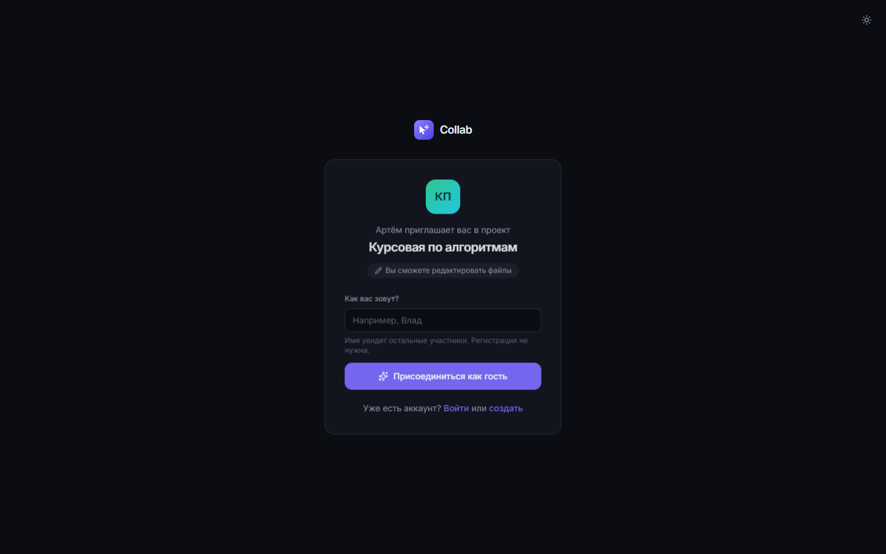
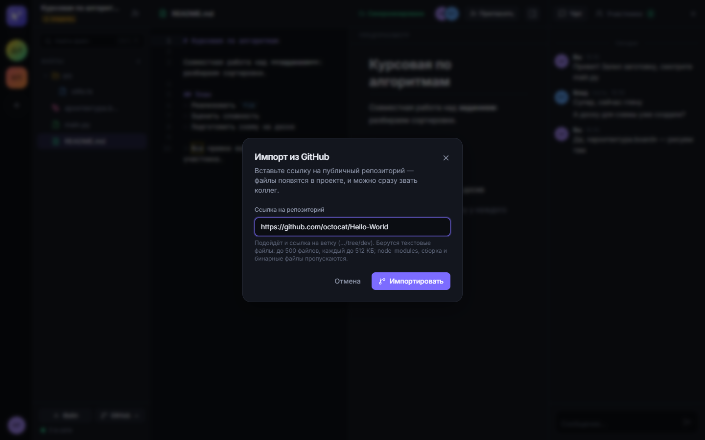
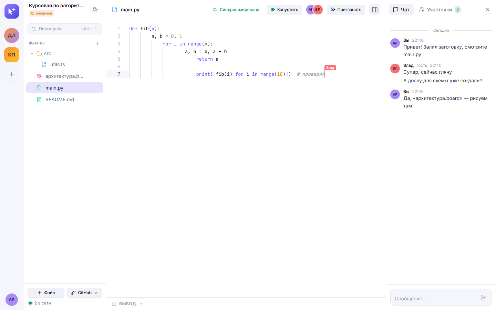
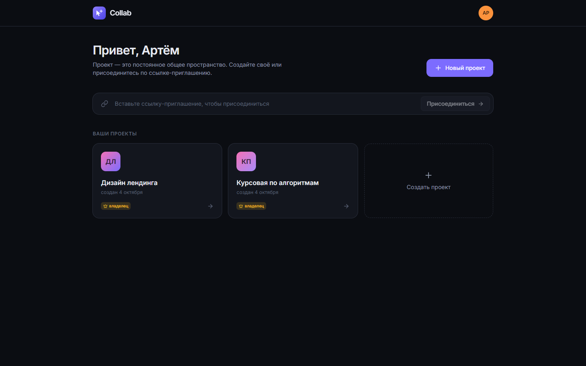
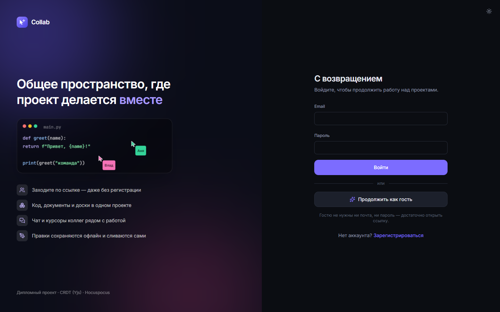
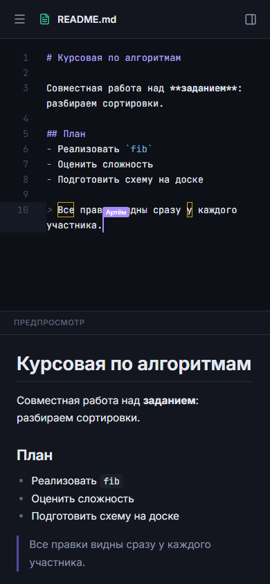

Снимки экрана создаются автоматически сквозным тестом
(`SCREENSHOTS=1 pnpm --filter @collab/e2e e2e screenshots`), поэтому их можно
обновить после любого изменения интерфейса.

## 2.6. Структура репозитория

Монорепозиторий на pnpm workspaces: `apps/{web,api,collab,runner}`,
`packages/{shared,db}`, `bench/` (стенд исследования), `infra/`, `docs/`. Общие
типы и схемы валидации (Zod) лежат в `packages/shared` и используются и
сервером, и клиентом, поэтому контракт между ними проверяется компилятором.
