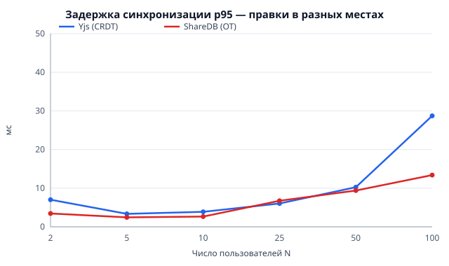
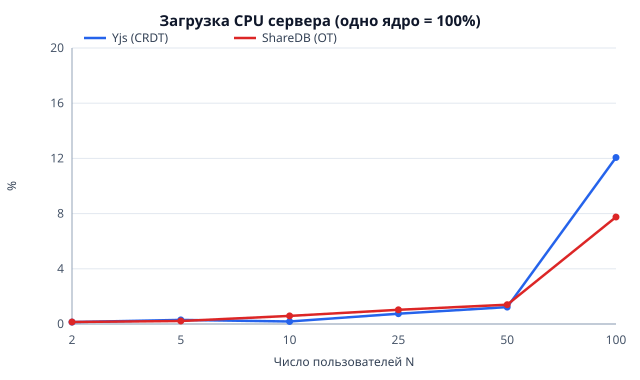
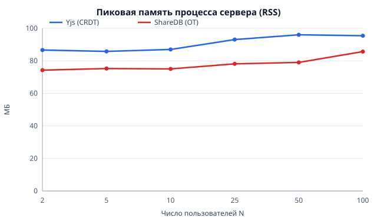
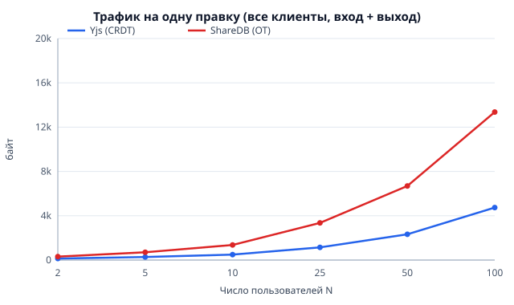
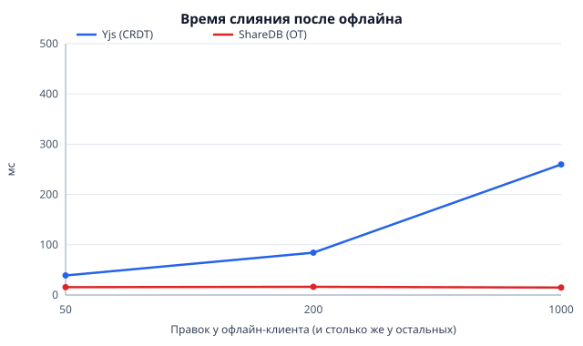
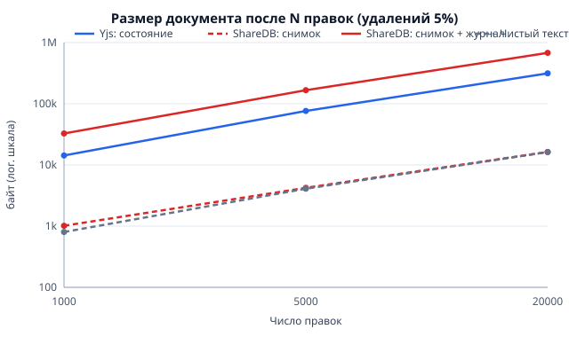
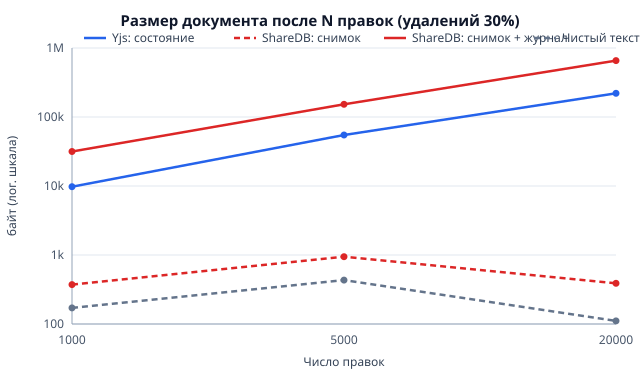
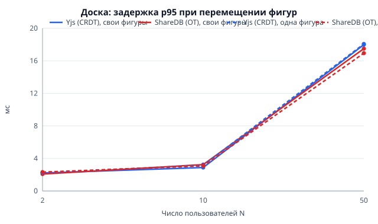

# 4 Исследование: CRDT против OT

## 4.1 Постановка

**Вопрос.** Какой подход — CRDT или OT — лучше подходит для совместного
редактирования кода по задержке, корректности и масштабируемости, особенно при
работе офлайн?

**Рабочая гипотеза.** CRDT даёт сопоставимую задержку при
небольшом числе пользователей и выигрывает в офлайн-сценариях, но проигрывает по
размеру документа и памяти.

**Сравниваемые системы.**

- CRDT: Yjs [8], сервер Hocuspocus [10] (тот же, что в платформе, без БД);
- OT: ShareDB [3] с типом `json0` [4] (текст — подтип `text0`), хранилище в памяти процесса.

Обе системы запущены без слоя хранения: сравнивается алгоритм синхронизации и его
сервер, а не база данных. Реализации стенда — каталог `bench/`; полные результаты
— `bench/results/REPORT.md` и `bench/results/latest.json`.

## 4.2 Методика

**Стенд.** Сервер каждой системы — отдельный процесс Node.js, что позволяет
измерять его CPU и память независимо от клиентов. Каждый клиент («бот») —
настоящий клиент своей системы (`HocuspocusProvider` с `Y.Doc` либо
`ShareDB.Connection`) с собственным WebSocket-соединением. В сценарии
одновременного набора боты распределены по отдельным процессам (до 12 клиентов
на процесс, не более 8 процессов; при N = 100 — по 12–13 клиентов); в остальных
сценариях все клиенты работают в управляющем процессе стенда. Задержка измеряется от вызова вставки у автора
до появления правки у другого клиента по общим часам машины. Все правки — вставки
уникальных меток вида `<c012.45>`: по ним можно проверить, что ни одна правка не
потеряна, и точно сопоставить отправку с получением.

**Контроль стенда.** Для каждого прогона фиксируется задержка цикла событий (p99)
в процессах с ботами; точка считается валидной, если она ниже 100 мс. Фоновое
значение на этой машине — около 20–25 мс (гранулярность таймеров Windows).
Максимум по всем 72 прогонам набора — 32 мс.

**Сценарии.**

1. *Одновременный набор:* N ∈ {2, 5, 10, 25, 50, 100} пользователей, каждый
   вставляет метку в среднем раз в секунду (экспоненциальные интервалы), 10 с.
   Два режима: правки в случайных границах меток («разные места») и вставка всеми
   в позицию 0 («одна позиция» — максимум конфликтов).
2. *Офлайн:* пять клиентов; один отключается, делает K правок локально
   (K ∈ {50, 200, 1000}), остальные за это время делают ещё K; затем клиент
   возвращается. Время слияния — от переподключения до совпадения текста у всех.
3. *Рост документа (один прогон на точку):* пять клиентов делают 1000 / 5000 / 20000 правок
   (вставка символа или удаление 1–5 символов) при доле удалений 5% и 30%;
   измеряется размер документа.
4. *Доска:* N ∈ {2, 10, 50} клиентов двигают фигуры (5 перемещений в секунду
   на клиента, 8 с) в двух режимах: каждый свою фигуру / все одну и ту же. Это другой
   тип CRDT (карта регистров вместо последовательности символов) против операций
   `oi`/`od` над объектом в OT.

**Метрики.** Задержка (среднее, p50, p95, p99), корректность (одинаковые хеши
текста у всех клиентов и наличие всех правок), загрузка CPU и пиковая память
серверного процесса, трафик на правку (байты, отправленные и полученные всеми
клиентами, делённые на число правок), размер документа, время слияния после
офлайна.

**Повторы.** Каждая точка сценариев 1, 2 и 4 повторена 3 раза; в таблицах — среднее,
разброс (минимум–максимум по повторам) указан для p95 и времени слияния.
Генератор случайных чисел детерминирован (`mulberry32`), зерно зависит от номера
повтора.

**Окружение.** Windows 11, AMD Ryzen 7 5700U (16 потоков), 14 ГБ ОЗУ, Node.js
22. Серверы и клиенты — на одной машине (loopback).

## 4.3 Результаты

Всего выполнено 138 прогонов: 72 (набор), 18 (офлайн), 36 (доска), 12 (рост
документа); в наборе — 23 498 правок.

### 4.3.1 Корректность

**Во всех 138 прогонах обе системы сошлись к одному тексту (одинаковые хеши у
всех клиентов), ни одна правка не потеряна, каждая правка доставлена каждому
получателю (доля доставки 100%).** Это относится и к режиму максимального числа
конфликтов (все вставляют в одну позицию), и к слиянию после офлайна, и к
одновременному перемещению одной фигуры многими клиентами. По корректности
различий нет: оба подхода решают задачу.

### 4.3.2 Задержка

Выдержки из результатов приведены в таблице 4.1 (подробно — `bench/results/REPORT.md`),
распределение p95 по числу пользователей — на рисунке 4.1.

Таблица 4.1 — Задержка доставки правки, мс (правки в разных местах документа)

| N | Yjs p50 | ShareDB p50 | Yjs p95 | ShareDB p95 |
|---|---|---|---|---|
| 2 | 2,0 | 1,6 | 7,0 | 3,4 |
| 25 | 2,8 | 2,0 | 6,0 | 6,7 |
| 100 | 9,9 | 5,0 | 28,7 | 13,4 |

Для режима «одна позиция» картина та же: p50 9,6 и 5,1 мс при N = 100.

Обе системы показывают задержку порядка единиц миллисекунд (p95 не выше 10,3 мс)
вплоть до 50 пользователей и до 29 мс (p95) при 100. До 50 пользователей значения
на порядок ниже порога, который человек замечает при наборе текста (порядка
100 мс), при 100 пользователях — в 3–4 раза ниже его. До 25
пользователей разница между системами — доли миллисекунды (ShareDB быстрее по
медиане на 0,4–0,8 мс; по p95 Yjs даже быстрее при N = 25). При N = 100 Yjs
примерно вдвое медленнее (p95 28,7 против 13,4 мс), но остаётся далеко от
заметных величин. Конфликтный режим (одна позиция) не ухудшает задержку ни у одной
из систем.



Рисунок 4.1 — Задержка p95 при правках в разных местах документа

### 4.3.3 Нагрузка на сервер и трафик

Загрузка CPU, память и трафик показаны на рисунках 4.2–4.4.

- **CPU сервера** у обеих систем не превышает 1,5% одного ядра до N = 50
  (среднее по повторам); при N = 100 — 12% (Yjs) и 8% (ShareDB). Нагрузка
  сопоставима.
- **Память процесса сервера (RSS):** у Yjs выше на 11–22% на всех N (например,
  87 против 74 МБ при N = 2 и 95 против 86 МБ при N = 100). Абсолютная разница —
  10–17 МБ.
- **Трафик на правку:** у Yjs в **2,2–2,9 раза меньше**, чем у ShareDB
  (141 против 311 байт при N = 2; 4743 против 13 360 при N = 100); в режиме
  «одна позиция» — в 2,4–3,3 раза меньше. Этот результат
  противоположен ожидаемому «CRDT тяжелее»: Yjs передаёт компактные бинарные
  обновления, ShareDB — JSON-сообщения с версиями и подтверждениями. Рост трафика
  на правку с N у обеих систем линейный, как и должен быть при рассылке каждой
  правки всем участникам.



Рисунок 4.2 — Загрузка CPU серверного процесса



Рисунок 4.3 — Пиковая память (RSS) серверного процесса



Рисунок 4.4 — Трафик на одну правку

### 4.3.4 Работа офлайн

Время слияния и трафик после работы без сети приведены в таблице 4.2 и на
рисунке 4.5.

Таблица 4.2 — Слияние после работы офлайн

| K правок | Yjs, слияние мс (разброс) | ShareDB, слияние мс (разброс) | Yjs, КБ | ShareDB, КБ |
|---|---|---|---|---|
| 50 | 39 (36–41) | 16 (15–16) | 16,0 | 5,6 |
| 200 | 84 (80–90) | 16 (16–17) | 67,3 | 16,8 |
| 1000 | 260 (239–301) | 15 (14–17) | 346,1 | 75,6 |

Обе системы слили правки без потерь, но **слияние у ShareDB быстрее и почти не
зависит от K, а у Yjs растёт с K; трафик при слиянии у Yjs в 2,9–4,6 раза больше**.
Это не подтверждает ожидание, что CRDT выигрывает в офлайн-сценарии по скорости
слияния. Вероятное объяснение (в рамках работы отдельно не проверялось):
клиент ShareDB, пока связи нет, не отправляет операции по одной, а складывает
неподтверждённые операции в очередь, операции которой библиотека может объединять
(композиция операций), и
сервер преобразует результат за небольшое число шагов; Yjs же интегрирует каждый
из ~2K новых элементов в позицию, найденную по цепочке ссылок, и пересылает их
как отдельные структуры. Преимущество CRDT в офлайне — не скорость слияния, а
отсутствие арбитра: слияние не требует от сервера знаний о порядке и работает
при любой топологии (в том числе когда сервер недоступен).



Рисунок 4.5 — Время слияния после работы офлайн

### 4.3.5 Размер документа

Размер удобно разделить на две величины: сколько байт нужно клиенту, чтобы
открыть документ («чтобы открыть»), и сколько хранится всего. У Yjs это одно и то
же — всё состояние, включая метки удаления. У ShareDB клиент получает только
снимок, а журнал операций (из которого можно восстановить любую версию) хранится
на сервере.

Результаты для доли удалений 5% (типичный набор текста) приведены в таблице 4.3,
зависимость размера от числа правок для долей удалений 5% и 30% — на
рисунках 4.6 и 4.7.

Таблица 4.3 — Размер документа при доле удалений 5%

| Правок | Yjs: открыть = всего, байт | ShareDB: открыть, байт | ShareDB: всего, байт | Текст Yjs / ShareDB, байт |
|---|---|---|---|---|
| 1 000 | 14 286 | 1 015 | 32 713 | 803 / 807 |
| 5 000 | 76 228 | 4 223 | 166 445 | 4 089 / 4 014 |
| 20 000 | 314 089 | 16 331 | 678 273 | 16 236 / 16 122 |

Вывод двойной. **Чтобы открыть документ, Yjs требует в 14–19 раз больше
байт, чем снимок ShareDB** (14 286 против 1 015 при 1000 правок; 314 089 против
16 331 при 20 000): состояние Yjs включает идентификаторы каждого вставленного
символа и метки удаления. **Но суммарно Yjs хранит в 2,2–2,3 раза меньше, чем
ShareDB со снимком и журналом** (около 15 байт на правку против 33).
При доле удалений 30% текст почти не растёт (100–750 байт), а Yjs растёт с числом
правок (≈ 10–11 байт на правку), потому что метки удаления сохраняются: при 20 000
правок состояние — 220 КБ ради текста в 111 байт, тогда как снимок ShareDB — 389 байт.
Следовательно, для документа с интенсивной правкой накладные расходы CRDT
реальны и растут с историей, а не с размером текста.



Рисунок 4.6 — Размер документа при доле удалений 5%



Рисунок 4.7 — Размер документа при доле удалений 30%

### 4.3.6 Доска дизайна

Задержка при перемещении фигур показана на рисунке 4.8.

Задержка при перемещении фигур у обеих систем совпадает в пределах разброса:
p95 около 2–3 мс при N ≤ 10 и 17–18 мс при N = 50 (p50 6–7 мс); режим «все двигают одну фигуру»
не отличается от режима «каждый свою». Во всех прогонах состояния всех клиентов
совпали. Для перемещения фигур выбор алгоритма практически не влияет на
результат; модель «карта регистров» достаточна.



Рисунок 4.8 — Задержка p95 при перемещении фигур на доске

### 4.3.7 Наблюдение о границах стенда

В пробных запусках при скорости набора 2 правки/с на пользователя и N = 100
Yjs показывал заметно большую задержку, чем ShareDB, и загруженность процессов с
ботами указывала на то, что узким местом стали клиенты, а не сервер. Поэтому
основная серия выполнена при 1 правке/с, где стенд не перегружен (контроль
описан в п. 4.2). Пробные запуски не входят в основную серию, их данные не
сохранены и не повторялись, поэтому это лишь наблюдение, а не результат: оно
указывает на то, что клиентская часть Yjs в Node.js при высокой интенсивности стоит дороже
клиентской части ShareDB, но требует отдельной проверки. В браузере каждый
участник — отдельный процесс, поэтому для реального применения это менее
существенно.

## 4.4 Проверка гипотезы

Сопоставление гипотезы с результатами приведено в таблице 4.4.

Таблица 4.4 — Проверка рабочей гипотезы

| Утверждение гипотезы | Результат |
|---|---|
| Сопоставимая задержка при небольшом числе пользователей | **Подтверждено.** До 25 пользователей разница медиан — доли миллисекунды; обе системы на порядок ниже заметного порога |
| CRDT выигрывает в офлайн-сценариях | **Не подтверждено по скорости слияния:** ShareDB быстрее (15–16 мс против 39–260 мс) и трафик меньше. Корректность одинакова. Преимущество CRDT архитектурное (нет арбитра), а не скоростное |
| CRDT проигрывает по размеру документа | **Подтверждено частично:** состояние, которое нужно клиенту для открытия, в 14–19 раз больше и растёт с историей правок; суммарно же хранение у Yjs в 2,2–2,3 раза компактнее ShareDB с журналом |
| CRDT проигрывает по памяти | **Подтверждено, эффект малый:** RSS сервера выше на 11–22% (10–17 МБ) |
| (не в гипотезе) трафик | У Yjs в 2,2–2,9 раза меньше на правку |

## 4.5 Угрозы валидности

- **Одна машина, loopback.** Нет реальной сети с задержкой и потерями пакетов;
  абсолютные значения задержки в реальной эксплуатации будут больше, а различия
  между системами — определяться в основном сетью.
- **Клиенты на Node.js, а не в браузерах.** Стоимость клиентской обработки в
  браузере другая; в основной серии генератор нагрузки не был узким местом
  (максимум задержки цикла событий 32 мс), но абсолютные значения клиентской
  стоимости не переносятся напрямую.
- **Серверы без БД.** Сравнивается алгоритм, а не полный стек; в платформе Yjs
  дополнительно сохраняет снимок в PostgreSQL.
- **Правки — вставки меток по 8–10 символов**, а не посимвольный набор; это
  упрощает проверку целостности, но делает единицу правки крупнее реальной.
- **Одна скорость набора** (1 правка/с на пользователя) и один документ; не
  исследована зависимость от очень больших документов (сотни килобайт текста) и
  интенсивных пиков.
- **Одна реализация OT** (`json0`/`text0`). Другие типы (`ot-text`, `rich-text`)
  и другие серверы могли бы вести себя иначе; объяснение разницы в слиянии после
  офлайна — предположение, проверка которого вынесена в дальнейшую работу.
- **Хранение журнала ShareDB** — в памяти процесса; размер журнала отражает
  объём данных, а не конкретный формат на диске.

## 4.6 Воспроизведение

```bash
pnpm --filter @collab/bench bench          # полный набор (≈ 30 минут)
pnpm --filter @collab/bench bench:quick    # быстрая проверка (≈ 2 минуты)
```

Результаты записываются в `bench/results/` (`latest.json`, `REPORT.md`,
`charts/*.svg`). Скорость набора меняется переменной `EDITS_PER_SECOND`.
Тесты стенда (`bench/src/scenarios.test.ts`) проверяют сходимость обеих систем во
всех сценариях на малых размерах.
